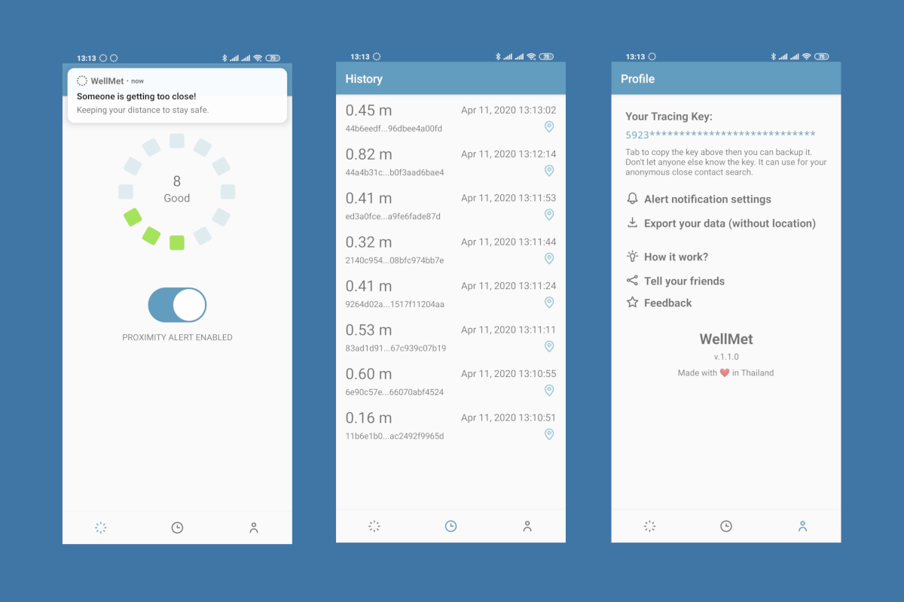

# WellMet - Social Distance Tracker

## Features
- Track close contact with another user via Bluetooth LE iBeacon technology.
- Alert when another user getting to close to keep the distance.
- Dashboard to summary met history number and social distance level.
- View detail of user close contact history e.g. time and place.
- Using an offline database but can export for further analysis and cannot trace back an individual more than a day.

## How it work?
WellMet is a social distance tracker. It allows the user to track the number of close contact from the smartphone Bluetooth sensor. By advertising and scanning device UUID(Universally unique identifier) using low energy wireless radio also known as the beacon, another user can collect and range the distance nearby devices by the signal strength. WellMet will collect other device’s UUID when only in close range at 2 meters and will alert the user when the device closer than 1 meter. The application will keep the record of the met device in the offline database on the user phone and show a number of close contact users within the last 7 days.

The privacy-first principle applied to WellMet design. Even the user device UUID has been advertised and everyone can collect it for tracking the user. The UUID is designed to collect without reveal user identity. It creates from the derivative of the unique user code one-way hashing with the date of advertising the UUID. The UUID will change daily to prevent tracking user location by other scanners over a day but still provide enough identity for the app to track numbers without counting a completely random beacon all the time.

The user code is a uniquely large number generate from a pseudo-random number generator. Because it cannot create the true random number in the computer, WellMet intentionally collects a phone number from the user to provide more uniqueness to the user code. The phone number can be any number the user likes. It does not use for any application beyond this.WellMet using only the offline database on the user phone. Not even internet permission required to run the app. From this high level of data privacy, it cannot be useful to other services. Health care services like WHO, local government could use the data to track potential close contact infected users. The data exporting feature comes to help. Without the user manually export and send their data to the service, the data still safe in the user's hand. The services can create an online infected database for other users to look up their advertised beacon UUIDs re-create from their user code to see if they ever get close contact with the infected and determine their own situation. Because of using the one-way hashing technique, no user can be tracked down by anyone, not by even the government or WellMet creator.

## Security Note
- WelMet's `USER_CODE` (256bits) generates from the user's phone number hashing with a random big number.
- Beacon UUID generated from `USER_CODE` hashing with the date of the advertise beacon to generate beacon UUID of the day and periodically change daily.
- If a user is infected. The authority can request data from the WellMet app on the infected user phone and create a database (or service) for other users to lookup.
- A user can search user close history from the database using their `USER_CODE` hashing with the dates of selection to get their beacon UUIDs and see if it in close contact with the infected user's database.
- Cannot track users back from the beacon UUIDs for more than a day to provide some level of privacy but still can produce a useful statistic number for the user.
- WellMet is a completely offline app. No internet connection needed, No SMS confirmation.

## License
WellMet - Social Distance Tracker

Copyright (C) 2020  Artiya Thinkumpang

This program is free software: you can redistribute it and/or modify
it under the terms of the GNU General Public License as published by
the Free Software Foundation, either version 3 of the License, or
(at your option) any later version.

This program is distributed in the hope that it will be useful,
but WITHOUT ANY WARRANTY; without even the implied warranty of
MERCHANTABILITY or FITNESS FOR A PARTICULAR PURPOSE.  See the
GNU General Public License for more details.

You should have received a copy of the GNU General Public License
along with this program.  If not, see <https://www.gnu.org/licenses/>.